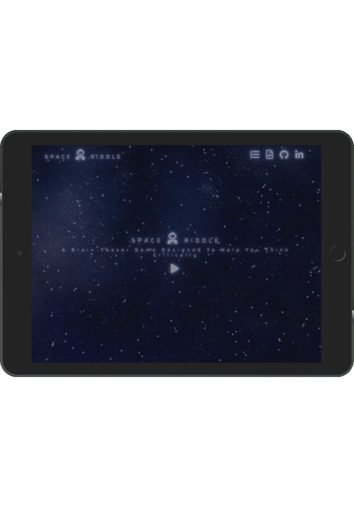
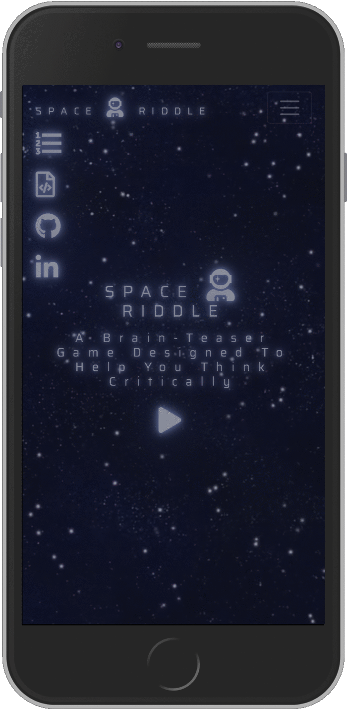

# SPACE RIDDLE - Guessing Game

## Table of Contents

<!--ts-->

- [About](#About)

  - [Goal](#Goal)
  - [Functionality](#Functionality)
  - [Initiation](#Initiation)

- [UX](#UX)

  - [Layout Pro (Boundless Adaptability)](#Layout-Pro-Boundless-Adaptability)
  - [Layout Con (Moderate Speed and Execution)](#Layout-Con-Moderate-Speed-and-Execution)
  - [Tablet Display](#Tablet-Display)
  - [Mobile Display](#Mobile-Display)
  - [Additional Note](#Additional-Note)
  - [Colour Scheme](#Colour-Scheme)
  - [Font](#Font)
  - [Navigation](#Navigation)

- [Technologies](#Technologies)

  - [Languages Frameworks Tools](#Languages-Frameworks-Tools)
  - [Other-Resources](#Other-Resources)

- [Features](#Features)

  - [Existing Features](#Existing-Features)
  - [Features-Left-to-Implement](#Features-Left-to-Implement)

- [Testing](#Testing)

- [Deployment](#Deployment)

  - [How the project got deployed to Heroku](#How-the-project-got-deployed-to-Heroku)
  - [How to access the live application](#How-to-access-the-live-application)
  - [How to run things locally](#How-to-run-things-locally)

- [Credits](#Credits)

  - [Content](#Content)
  - [Media](#Media)
  - [Acknowledgements](#Acknowledgements)
    <!--te-->

## About

This application (app) is a game that asks players to guess the answer to a text-based riddle.

#### Goal

Create a multi-player guessing game, suitable for website usage. The core focus of this project is on functional game logic created with Python while utilising the Flask micro web framework also written in Python.

#### Functionality

- A web application game that requests that players surmise the response to a content-based riddle.
- Riddles are generated and presented to players in the form of text.
- Players enter their answer into a text field and submit using a form.
- If a player's guess is correct, they progress to the next riddle.
- If a player’s guess is incorrect, their incorrect solution is stored and printed below the riddle.
- Player’s given two chances total at a guess, after which point the game will progress to the next riddle regardless of whether or not the player has guessed the riddle answer correctly.
- The text area is reset to blank after every guess attempt so that players can guess again. Players are identified by a unique username which allows for multiple players to play an instance of the game at the same time.
- Top scores for the main three players are positioned and added to a leader board.

#### Initiation

Research to understand what apps of similar scope were already doing in terms of functionality which provided me with a list of what I consider to be feasible options for functionality implementations to acknowledge and consider pre-production.

## UX

#### Layout Pro (Boundless Adaptability)

- Choosing a multiple page application (MPA) takes into consideration the choice to make new content and spot it on new pages. Multi-page applications can incorporate as much data as required, for this situation, numerous riddles, name enrolment page and a score board rank, with no page confinements.
  To say it essentially, in light of the fact that there is a fair amount of content and features included on the application, I feel that a MPA is the best decision.

#### Layout Con (Moderate Speed and Execution)

- Being as this is a multi-page application, a server needs to reload most assets, for example, HTML, CSS, and Python with each interaction. When loading another page, the browser completely reloads page information and downloads all assets once more, even segments that are rehashed throughout all pages (for example the header/navigation). This influences Speed and Execution.

#### Tablet Display

- Please note, except a slight difference in page/scale responsiveness, desktop applies the same UI.



#### Mobile Display

- This image animation represents the standard UI across most modern mobile devices.



#### Additional Note

- Games generally require the users to interact consistently; thus, although the game spreads across multiple separate pages, the developed app is in a way that keeps interaction on the included individual pages dense.

#### Colour Scheme

- The generation of a bespoke colour was accomplished by blending RGB and Hex colours to those of a video background via the use of HTML & CSS.

  -  `#1b213a` color description : Very dark desaturated blue.

    - text-shadow
    - background
    - background-color

  -  `#8b97c9` color description : Slightly desaturated blue.

    - text-shadow

  -  `#f6f7fb` color description : Light grayish blue.

    - color

A colour encyclopedia provided by [ColorHexa](https://www.colorhexa.com/ "ColorHexa Official Site") was used to generate matching colour palettes.

A placeholder image service provided by [Placeholder.com](https://placeholder.com/#How_To_Use_Our_Placeholders "Placeholder.com Official Site") was used to provide a list of colours for reference in the README file.

- Opacity/Transparency – property to add transparency to the background of an element.

  - Navigation-bar

- Text-shadow CSS – property to add shadow effects to text.

  - Navigation-bar

- Colour-overlay – a large background image overlayed with a translucent color and text.

  - Body

#### Font

- Being as the website modelling is off a space theme a square geometric sans-serif typeface choice was selected; thus, helping to emphasise a futuristic and sci-fi vibe to the displayed text content; a subjective opinion, of course.

#### Navigation

- Fixed navigation makes it easier for users to browse the website and increase retention: In some ways, it's a passive call to action; always visible, always available.

- Maintaining the logo visible increases brand value. Today there is an enormous number of apps, many with identical or similar features, so I feel that it’s vital to make a good impact on users and retain their interest, which can be all linked to a good brand image.

## Technologies

#### Languages Frameworks Tools

- [HTML](https://www.w3.org/TR/html5/ "HTML5 Official Site")

  - Semantic markup language utilised as the shell of the site.

- [CSS](https://www.w3.org/Style/CSS/ "Cascading Style Sheets Official Site")

  - Cascading Style Sheets as the design of the site.

- [Python](www.python.org)

  - Utilised to compose the game logic.

- [Flask](http://flask.pocoo.org/)

  - Utilised for routing through application, redirecting and rendering HTML templates.

- [Jinja2](http://jinja.pocoo.org/docs/2.10/)

  - Utilised to render html templates, imparting between front-end and back-end.

- [jQuery](http://jquery.com/ "Cascading Style Sheets Official Site")

  - HTML document traversal and manipulation, event handling.

- [Bootstrap](https://getbootstrap.com/docs/4.1/getting-started/introduction/ "Bootstrap Official Site")

  - Utilised for developing the entire UI and consistent throughout

- [Google Fonts](https://fonts.google.com/ "Google Fonts Official Site")

  - Saira font applied across the entire website

- [Font Awesome](https://fontawesome.com/ "Fontawesome Official Site")

  - Source for all utilised icons

#### Other Resources

- [w3schools](https://www.w3schools.com/)
- [Stack Overflow](https://stackoverflow.com/)
- [Slack](https://slack.com/)

## Features

#### Existing Features

- Home Page

  - Used to access the user registration page field.

- User Registration

  - Utilised to enter player name and progress to game start.

- JSON

  - Store player high scores for each game play instance and hold the game riddles.

- Message Notifications

  - Inform a player of their current score, when errors are made in answer guessing and displaying player's the final score.

- Form
  - Enter player responses to the riddles.

#### Features Left to Implement

- More riddles, with an arbitrary determination, exhibited each time a player login/registers; thus, enabling them to play the game on different occasions without seeing similar riddles repeatedly.

- Audio sound/effects which would improve increase the user experience.

- The alternative to come back to the game with a current player name. Without secure player confirmation, which is beyond the scope of this module, there is currently no way to separate between a returning player and a player who has picked the equivalent player name as another player. Subsequently, players must choose another player name each time they register.

- Revealing the correct answers to the riddles at the end of the game would improve the user experience. However, this would work better with a relational database (RDB), which contained a multitude of different riddle question groups. Riddle data would be accessed and reassembled on an automatic and rotational basis on each initiation of the game, so to provide the user with extra variety after being made aware of the correct answers for a particular riddle batch on a previous game effort.

## Testing

- (Pending)

## Deployment

#### How the project got deployed to Heroku

- Select Extensions and install [Heroku-cli](https://devcenter.heroku.com/articles/heroku-cli)

  - If you haven't already, log in to your Heroku account and follow the prompts to create a new SSH public key.

\$ heroku login
Clone the repository
Use Git to clone space-riddle-game's source code to your local machine.

```console
$ heroku git:clone -a space-riddle-game
$ cd space-riddle-game
```

Deploy your changes
Make some changes to the code you just cloned and deploy them to Heroku using Git.

```console
$ git add .
$ git commit -am "make it better"
$ git push heroku master
```

#### How to access the live application

- A live demonstration is accessable by clicking [here](https://space-riddle-game.herokuapp.com/ "Live Demonstration: Space Riddle - Guessing Game").

#### How to run things locally

1. Download the project onto a PC and open with a source-code editor.
2. In the run.py file set the IP address to 127.0.0.1 and the PORT to 5000.
3. Install all of the prerequisites shown in the requirements.txt file.
4. Initiate the app by entering the following command into a relevant terminal: python run.py

## Credits

#### Content

- Except for the app (game) riddles, all written content is bespoke and created by the code author (Sipo Charles).

#### Media

- N/A

#### Acknowledgements

- I received inspiration for this project from visiting [miniclip.com](https://www.miniclip.com/games/en/ "Miniclip Official Site"), but mostly from my interaction with other students on Code Institute's Full Stack Software Development Programme.

#### Disclaimer

This is for educational purposes only.
